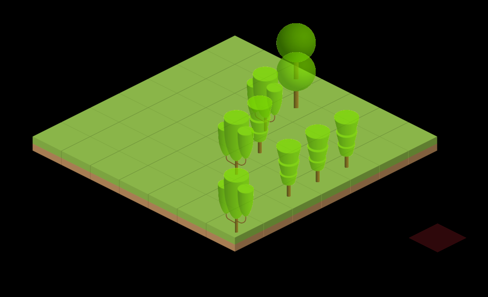
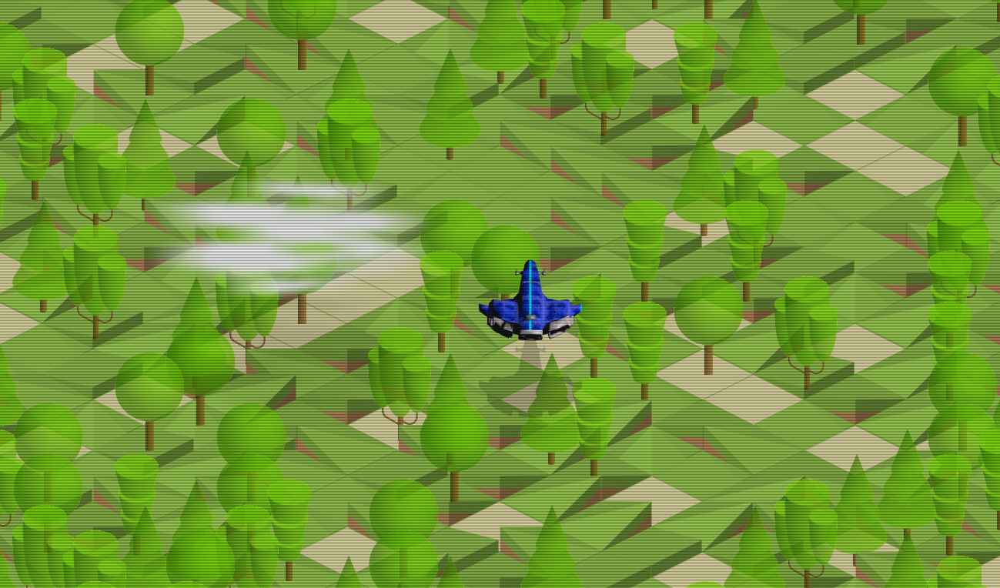

# isometric_shooter

Two Go files, the first is just an isometric square generator with random trees, the second is a basic engine layout for a top down shooter game with isometric tiles and clouds. The terrain is randomly generated as are the trees and cloud movements and sizes. Arrow keys control the spaceship and + and - keypad for zoom level, END key closes the window.

  

  

                                         
